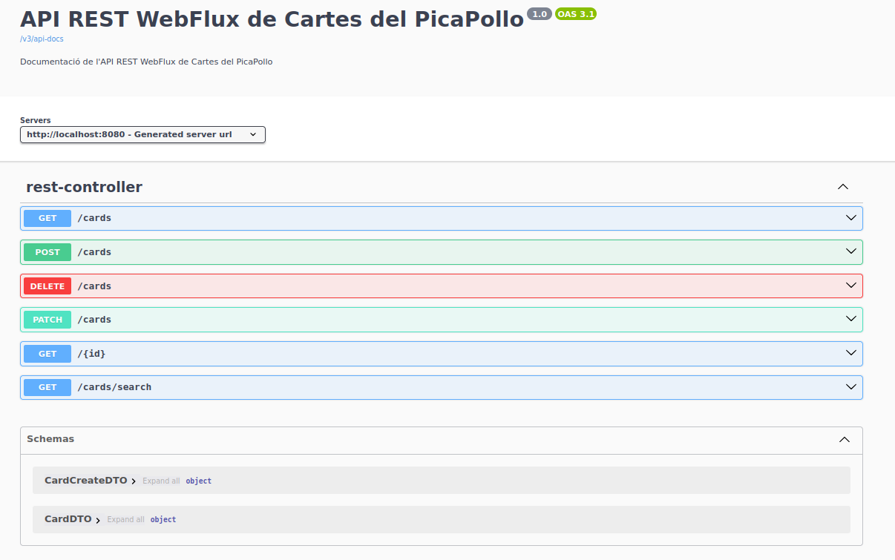
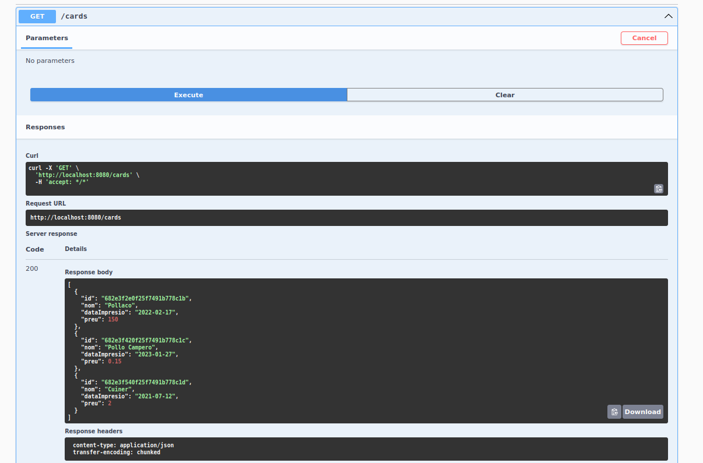
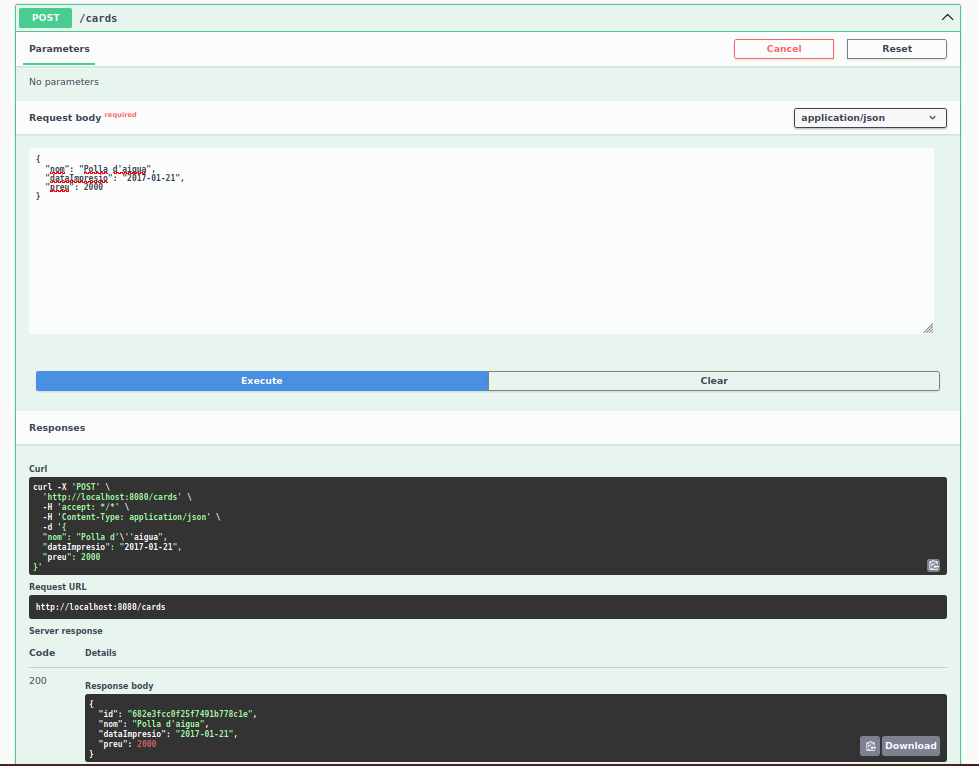
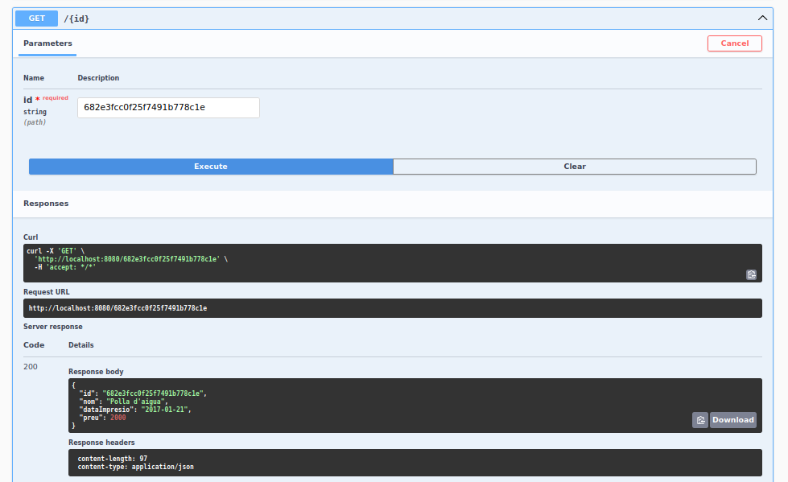
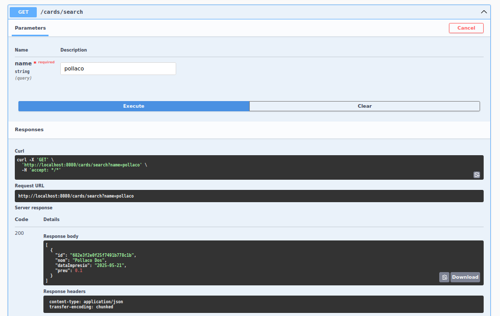
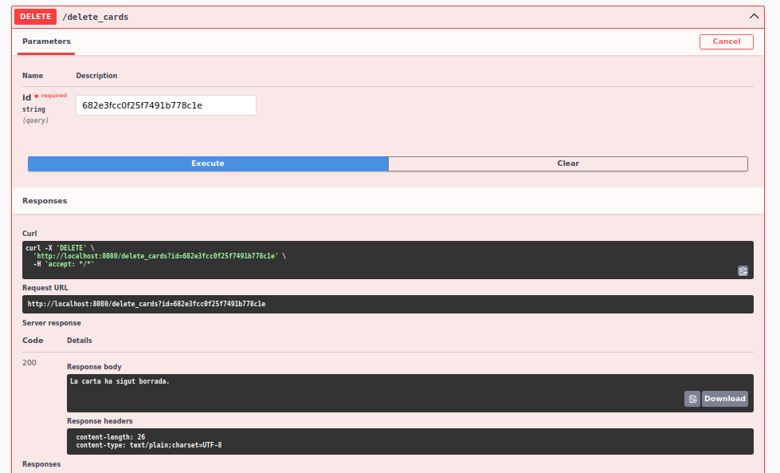

# Documentació
## Nota prèvia
En algun cas, executant l'aplicació en diferents dels nostres equips, ens trobem amb un error en temps de compilació, on no es troba alguna implementació a injectar. Si passa això, ho arreglem fent una complació manual del programa. Des de la carpeta arrel del projecte, executem:
```bash
./mvnw clean compile
```
Amb això recarregarem dependències, i tornarem a generar nous .class amb l'última versió del codi, permetent-nos ara si, executar l'app sense problemes.  

## Preguntes teòriques
### 1. Què caracteritza una API reactiva com aquesta i què la fa diferent d’una API síncrona amb MVC com les treballades anteriorment?
Una **API reactiva**, com la que s’utilitza amb **Spring WebFlux**, es caracteritza per ser **asíncrona i no bloqueja**. Això vol dir que:

- No bloqueja el **fil d'execució** mentre espera una resposta (per exemple, d’una base de dades o d’un servei extern).
- Pot gestionar **moltes peticions simultànies amb menys recursos**, cosa que la fa molt més escalable.

En canvi, una API **síncrona amb Spring MVC**:
- Bloqueja el fil fins que es rep una resposta.
- Està basada en un model tradicional (una petició = un fil).
- És més senzilla, però menys eficient sota càrrega elevada.
---

### 2. Què signifiquen `Mono` i `Flux`? Per a què penseu que serveixen i per què són útils en aquest tipus de programació?

- **`Mono<T>`** representa **zero o un valor** asíncron.
- **`Flux<T>`** representa **zero o més valors** (un flux de dades).

- Permeten treballar amb dades asíncrones sense bloquejar fils.
- Faciliten la manipulació funcional de dades amb operadors com `map`, `flatMap`, `filter`, etc.

**Són útils perquè permeten desenvolupar aplicacions més reactives, escalables i amb millor rendiment.**

---

### 3. Què és un `record`? Un `record` utilitza getters i setters? Justifiqueu la resposta.

Un `record` a Java és una classe especial **immutable** pensada per representar **objectes de dades** de forma concisa.

No utilitza setters, ja que els seus camps són finals i immutables.

Sí utilitza getters, però no segueixen el format clàssic getX(). En canvi, s'accedeix amb el nom del camp directament (cardDTO.name()).

## Proves d'execució
### Pàgina completa del swagger al connectar des del navegador:


### Obtenim tots els registres de la colecció


### Afegim un registre


### Buscar per id. Comprovem alhora que el registre anterior s'ha afegit correctament


### Modificar un registre: agafem l'element "Pollaco" i li canviem les dades


### Cerquem per nom, i comprovem que l'element anterior s'ha modificat


### Eliminar un registre segons el seu ID
  


